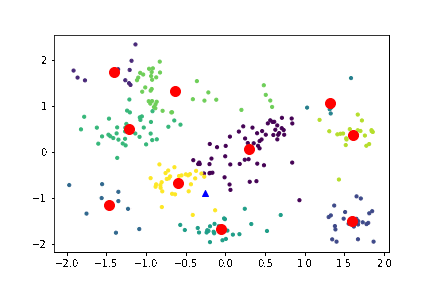

# PRecommender

The **precommender** model is used to generate a probability distribution for every user's shopping trip, which products he/she is likely to buy. This is used to create a shopping list. 

This model uses LSTM to perform a prediction based on the receipts collected in the past. Since this collected receipts are simply not enough, we started to search for a solution that makes a compromise between userfriendlyness and data quality, but quickly discovered, that it would be to much of a burden for the user to generate the data necessary.

"What do you do, if you have no idea on how to solve a problem? Right, ask the public! (Stackoverflow :D)"

This sentence sort of shows what other solution we came up with. The solution got the name **KNetworks**...

<br><br>

### KNetworks



With **KNetworks**, we found a way of training a network (or should I say *k* networks) to be able to perform this task even with the lack of userspecific data. 

The algorithm uses the <a target="_blank" href="https://theory.stanford.edu/~sergei/papers/kMeansPP-soda.pdf">kmeans++</a> algorithm to classify every user by the average product count per week.

The GIF to the right shows exactly this (Here, we are using a feature size of two (to draw it in 2d), which obviously can be choosen as pleased).

Next up, we initialize a LSTM network for each found centroid and start a weighted training on the whole dataset, where the representation of each data point is based on the euclidean distance from the centroid.

This will create _k_ LSTM networks which are specialized on the data of the nearest data points (the users).

This method proposes some key advantages, making it a good one to choose:

- The prediction for every user are not only driven by their own data, but also by user with a similar shopping behaviour
- We only need a small amount of neural network as opposed to generating one for every user
- User with a basically minimal data pool can get predictions
- We have a way bigger data pool for each network to train with. This will increase the performance of the model.

In order to get a prediction, we follow a similar approach as show in the training step. We retrieve the probability distributions from **every** network and use a weighted mean as our final prediction.

<br><br>

#### Training 

We train *k* LSTM networks, which we will call *centroid networks* (**CN**), where *k* is simply the *k* used by the <a target="_blank" href="https://theory.stanford.edu/~sergei/papers/kMeansPP-soda.pdf">kmeans++</a> algorithm (we use the <a target="_blank" href="https://en.wikipedia.org/wiki/Elbow_method_(clustering)">ELBOW method</a> to optimize *k* by maximising the <a target="_blank" href="https://en.wikipedia.org/wiki/Silhouette_(clustering)">sillhouette score</a>) on the whole dataset with a **W**eighted **R**andom **S**ampler (<a target="_blank" href="https://utopia.duth.gr/~pefraimi/research/data/2007EncOfAlg.pdf">WRS</a>). 

Where the weight for every data point is determined by the normalized euclidean distance between the CN's centroid coordinates $p$ and the users point coordinates $q$:

<div style="display:flex;justify-content:center;margin-top:50px;margin-bottom:50px">
$d = \sqrt{(\displaystyle\sum_{i=1}^n q_i + p_i)^2}$
</div>

We create a distance vector $D$ defined by the distances of every user data point and normalize it using the softmax function to get the weight $w$ for every point:

<div style="display:flex;justify-content:center;margin-top:50px;margin-bottom:50px">
$w_i = \displaystyle\frac{e^{D^i}}{\sum_{j=1}^n e^{D^j}}$
</div>

These weights are used to train the CN with a random user data pool batch choosen by the **WRS**.

This training method leads to a specialization of the CNs on the user data pools that are fairly near to the cluster centers. Hence we have created a sort of "expert" network for each special set of users. This method has some drawbacks regarding generalization which will be tackled in the next section.

<br><br>

#### Predicting
Getting predictions out of this special arrangement of CN's is fairly simple. 

Let's say we want a prediction for the user $u$ with the data pool $p$. We can retrieve a probability distribution $d_i$ containig the buying-probability of every product from the CN cluster by collecting the output of every CN using $p$ as an input.

Afterwards we are going to calculate a compount distribution $d_{res}$ by using the normalized euclidean distance, as already shown in the Training section, as a factor for every CN distribution and calculating the mean:

<div style="display:flex;justify-content:center;margin-top:50px;margin-bottom:50px">
$d_{res} = \displaystyle\frac{\sum_{i=1}^k w_i \cdot d_i}{k}$
</div>

So what is $d_{res}$ exactly?

To explain it with an analogy:

*We asked every "expert" network for it's opinion on the given data pool. Since the data pool corresponds to a specific user, the opinion of the "expert" for this user has a higher value as the one of the others. The more "knowledge" or "expertise" a CN has of the given user, the higher the value of their opinion. In the end, we take every opinion in account to compile a prediction for the user.*

This eliminates the drawback introduced in the Training section.

<br><br>

#### Pseudocode

The following are some python flavored pseudocode representations of the KNetworks algortihm.

##### Initializing the centroids
```python
centroids := empty array
append a random n-tuple to centroids

for c_id in range(k-1):
    dist := empty array
    for point in data:
        d := infinity
        for i in range(size of centroids):
            temp_dist := distance(point, centroids[i])
            d = min(d, temp_dist)
        append d to dist
    
    next_centroid := data[argmin(dist), :]
    append next_centroid to centroids
```

##### Fitting the centroids to the data
```python
points := array with n-tuples
epochs := number of epochs

for epoch in range(epochs):
    distances := calcDistances(centroids, points)
    affiliations := argmin(distances)
    centroids = mean of point n-tuples around the centroids
```

##### Creating k LSTM networks
```python
networks := empty array
for i in range(k):
    append LSTM to networks
```

##### Training the k LSTM networks
```python
data := the user data
for i in range(k):
    sData = select data of users within a specific radius
    networks[i].train(sData)
```