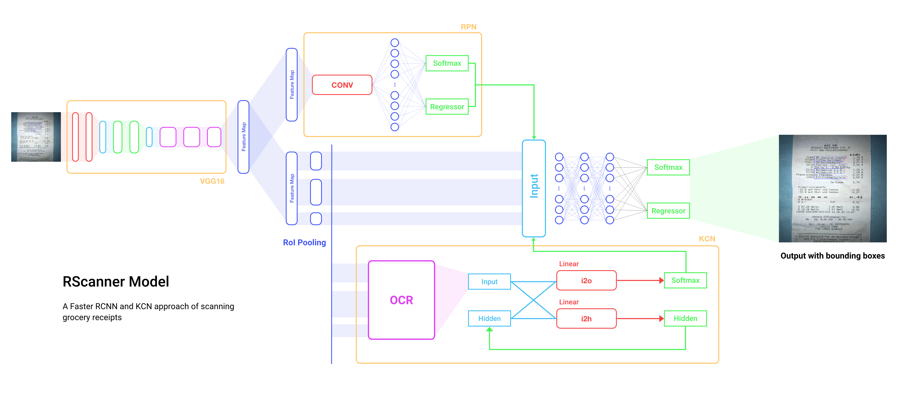
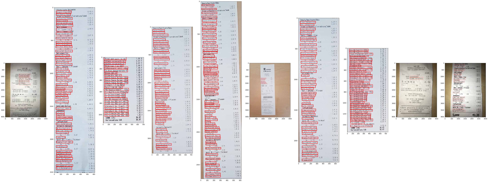
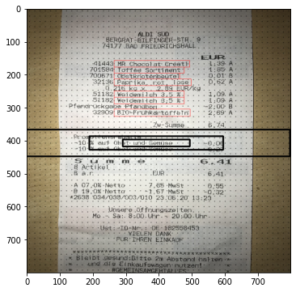
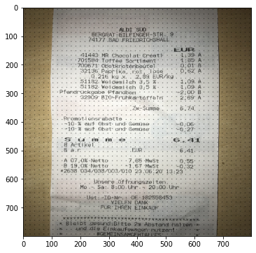

# RScanner

The RScanner model is used to extract the products from the pictures of the receipts. This task showed to not be as trivial as initial thought. There are several problems with common german receipt that I would like to introduce and show their influence on the developed model.

### Problem 1
Receipts are not standardized in Germany, hence every super market / store uses it's own layout and a different nomenclature.
This makes it nearly impossible to use <a target="_blank" href="https://en.wikipedia.org/wiki/Regular_expression">regex</a> or any other layout based method to extract the products. This quickly resulted in a ML approach using <a target="_blank" href="https://en.wikipedia.org/wiki/Recurrent_neural_network">RNN's</a> which was supposed to learn the linguistic characterisics of product names like common word stems.

This method however showed a very low accuracy and was basically not useable at all.

The low accuracy was caused by many different things, but we soon found out, that there was another major complication regarding german receipts.

### Problem 2
Some receipts have unrelated / unwanted words in positions, where you usually would find the wanted information. These words are for example categories of the following products or words that are related to the german deposit and return system.

## The RScanner model

  

The above image is an overview of the model as a whole. We will go through every part and explain in detail how it works and why the model looks like this.

The basic idea of this model is, that it is necessary to have an idea of common layouts and a basic understanding of the german language.
If a human tries to figure out, what product he bought by looking at his receipt, he knows the layout of the receipt and can determine whether a word he is reading is actually a product or unwanted information.

The model tries to mimic these steps by using a Region Proposal Network for learning the layouts of the receipts and a Keyword Context Network paired with optical character recognition to determine whether a propsed region inhabits a word, that resembles a product.

The core of the model is <a href="https://arxiv.org/pdf/1506.01497.pdf" target="_blank">FasterRCNN</a>, which we use to train the Region Proposal Network.

### Data preparation

The input for our model are obviously resized images of the receipts. In the training process, we collected a medium amount of receipts and started labeling them with boundingboxes. We are defining a bounding box over every product name and use these boxes as a ground truth for the training process.

We used <a href="https://github.com/tzutalin/labelImg" target="_blank">LabelImg</a> to perform the labeling in a fast and comfortable way.

    

### Anchorboxes

We start of by defining our anchorpoints for the FasterRCNN part of the model. The FasterRCNN model basically performs $n$ predictions by iterating over every anchorbox that is created from each anchorpoint. To get a good idea on what is going on, we would recommend a great explanation by Anders Christansen over at <a href="https://medium.com/@andersasac/anchor-boxes-the-key-to-quality-object-detection-ddf9d612d4f9" target="_blank">Medium</a>. 

To the right you can see two images showing the process of creating said anchorboxes by equaly distributing $n$ anchorpoints over the image (first image) and creating $n$ anchorboxes for every anchorpoint (second image).

### Feature map extraction using pretrained VGG16

### The Region Proposal Network
TODO
### The Keyword Context Network
TODO
### Training: The loss function and backpropagation
TODO
