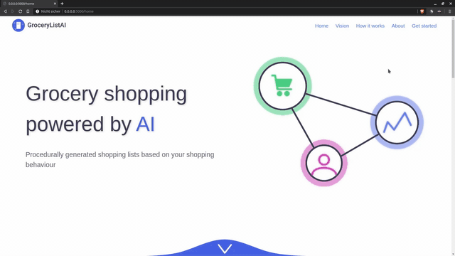

# The webapp

We build a webapp using <a target="_blank" href="https://flask.palletsprojects.com/en/1.1.x/">flask</a> and a custom designed website, which makes it easy to use the developed models. Our main goal was to provide an easy interface for the users to get the most out of our models.

The webapp will guide the user through the process of data collecting and displays the prediction our model made.

  
